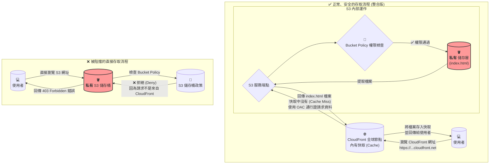
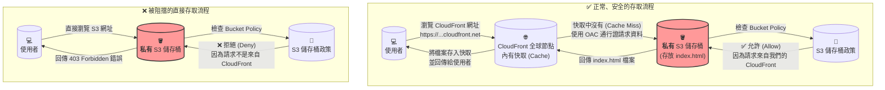
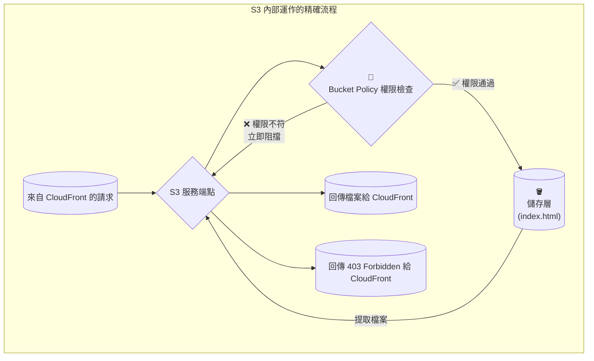

```mermaid
graph TD
    subgraph "✅ 正常、安全的存取流程 (整合版)"
        User[("💻<br>使用者")] -->|"瀏覽 CloudFront 網址<br>https://...cloudfront.net"| CF[("🌐<br>CloudFront 全球節點<br>內有快取 (Cache)")]
        
        %% CloudFront 請求進入 S3 的服務端點
        CF -->|"快取中沒有 (Cache Miss)<br>使用 OAC 通行證請求資料"| Gateway{"S3 服務端點"}

        %% 這裡嵌入了 S3 的詳細內部運作流程
        subgraph S3 內部運作
            Gateway --> Policy{"📜<br>Bucket Policy 權限檢查"}
            Policy -- "✅ 權限通過" --> Storage[("🪣<br><b>私有</b> 儲存層<br>(index.html)")]
            Storage -->|"提取檔案"| Gateway
        end

        %% S3 服務端點將檔案回傳給 CloudFront
        Gateway -->|"回傳 index.html 檔案"| CF
        
        %% CloudFront 將檔案回傳給使用者
        CF -->|"將檔案存入快取<br>並回傳給使用者"| User
    end

    %% 被阻擋的流程保持不變
    subgraph "❌ 被阻擋的直接存取流程"
        User2[("💻<br>使用者")] -->|"直接瀏覽 S3 網址"| S3_Blocked[("🪣<br><b>私有</b> S3 儲存桶")]
        S3_Blocked -->|"檢查 Bucket Policy"| Policy_Blocked[("📜<br>S3 儲存桶政策")]
        Policy_Blocked -->|"❌ 拒絕 (Deny)<br>因為請求不是來自 CloudFront"| S3_Blocked
        S3_Blocked -->|"回傳 403 Forbidden 錯誤"| User2
    end

    %% 套用樣式
    style Storage fill:#FF9999,stroke:#333,stroke-width:2px
    style S3_Blocked fill:#FF9999,stroke:#333,stroke-width:2px
```

----

```mermaid
graph TD
    subgraph "✅ 正常、安全的存取流程"
        User[("💻<br>使用者")] -->|"瀏覽 CloudFront 網址<br>https://...cloudfront.net"| CF[("🌐<br>CloudFront 全球節點<br>內有快取 (Cache)")]
        CF -->|"快取中沒有 (Cache Miss)<br>使用 OAC 通行證請求資料"| S3[("🪣<br><b>私有</b> S3 儲存桶<br>(存放 index.html)")]
        S3 -->|"檢查 Bucket Policy"| Policy[("📜<br>S3 儲存桶政策")]
        Policy -->|"✅ 允許 (Allow)<br>因為請求來自我們的 CloudFront"| S3
        S3 -->|"回傳 index.html 檔案"| CF
        CF -->|"將檔案存入快取<br>並回傳給使用者"| User
    end

    subgraph "❌ 被阻擋的直接存取流程"
        User2[("💻<br>使用者")] -->|"直接瀏覽 S3 網址"| S3_Blocked[("🪣<br><b>私有</b> S3 儲存桶")]
        S3_Blocked -->|"檢查 Bucket Policy"| Policy_Blocked[("📜<br>S3 儲存桶政策")]
        Policy_Blocked -->|"❌ 拒絕 (Deny)<br>因為請求不是來自 CloudFront"| S3_Blocked
        S3_Blocked -->|"回傳 403 Forbidden 錯誤"| User2
    end

    style S3 fill:#FF9999,stroke:#333,stroke-width:2px
    style S3_Blocked fill:#FF9999,stroke:#333,stroke-width:2px
```

```mermaid
graph TD
    subgraph "S3 內部運作的精確流程"
        Request[("來自 CloudFront 的請求")] --> Gateway{"S3 服務端點"}
        Gateway --> Policy{"📜<br>Bucket Policy 權限檢查"}
        
        Policy -- "✅ 權限通過" --> Storage[("🪣<br>儲存層<br>(index.html)")]
        Storage -->|"提取檔案"| Gateway
        Gateway --> SuccessResponse[("回傳檔案給 CloudFront")]

        Policy -- "❌ 權限不符<br>立即阻擋" --> Gateway
        Gateway --> DeniedResponse[("回傳 403 Forbidden 給 CloudFront")]
    end
```