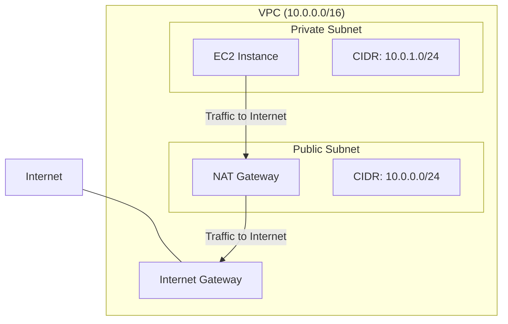
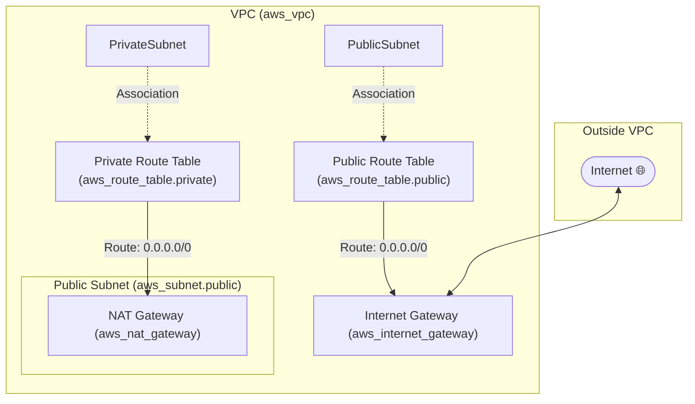
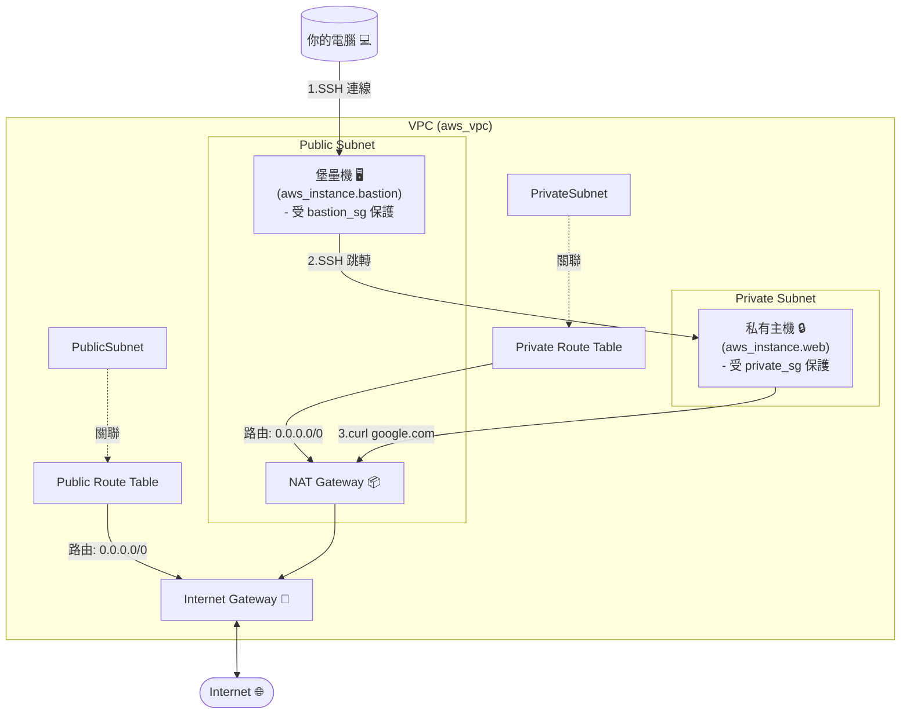

# 學習目標
1. 嘗試了解 VPC，了解何為 VPC, cidr, subnet, route table, NAT gateway, internet gateway，如果可以，請嘗試畫看看架構圖。
2. 嘗試手動操作，創建一個有兩個 subnet 的 vpc，並且分成 private 跟 public subnet
3. 使用 nat gateway 確保 private subnet 可以存取 internet(google.com)
4. 驗證：在 private subnet 內創建 ec2，並且嘗試在該 ec2 內去 curl google.com

# VPC 與 CIDR 的關係
兩者之間的關係有點像是： VPC 就是整個社區的圍牆，而 CIDR 就是我們向戶政事務所申請的地址範圍，未來所有蓋在這個社區裡的房子（例如 EC2 虛擬主機），都會從這個範圍內獲得一個自己的門牌號碼（也就是內部 IP 位址）

而在實務上切分有多少住宅的方式是透過 10.0.0.0/16 的 /16 來決定，這個 /16 代表的是「子網路遮罩」（subnet mask），它決定了我們可以在這個 VPC 裡面擁有多少個可用的 IP 位址。而剛剛提到的 /16 總共可以提供 2¹⁶ = 65,536 個 IP 位址

# Subnet 切分
目前先以 10.0.0.0/16 為基準，我們可以將這個大的網段切分成多個較小的子網路（subnet），每個子網路都有自己的 CIDR 範圍。

如果我們要區分成 public subnet 跟 private subnet，可以這樣切分
Public Subnet: 10.0.0.0/24
Private Subnet: 10.0.1.0/24
會這樣切也會比較方便，兩個相鄰但是不重複的網段，這樣在設定路由表的時候會比較清楚


# IGW（Internet Gateway）跟路由表（Route Table）
如果要讓 public subnet 可以存取 internet 的話，必須要有一個 internet gateway，這個 internet gateway 就像是社區的大門一樣，讓住戶可以進出社區。

有大門還不夠，還需要有路由表（route table）來告訴住戶們，當他們想要去外面的世界（例如 google.com）時，應該要走哪一條路。

而要這樣做的話，需要在 Public Subnet 的路由表上寫下這條規則：
- 目的地 (Destination): 0.0.0.0/0
- 目標 (Target): 我們的 Internet Gateway (IGW)
要表達到「任何地方」或「網際網路上的所有位址」時，我們會用一個特殊的 CIDR 來表示：0.0.0.0/0

# NAT Gateway
NAT Gateway 的作用是讓 Private Subnet 裡的 EC2 可以存取外部網路（例如 google.com），但同時又不讓外部網路直接存取這些 EC2。

但是就算有了 NAT Gateway，Private Subnet 裡的 EC2 還是無法直接存取 internet，因為他們沒有直接連接到 Internet Gateway。還需要在 public subnet 裡面建立一個 NAT Gateway，然後在 Private Subnet 的路由表上添加一條規則，指示所有要去外部網路的流量都應該經過這個 NAT Gateway。

# VPC 架構圖 



## 尚未加入 EC2 的 VPC 架構圖


## 已加入 EC2 的 VPC 架構圖


# 備註
連線方式可以參考以下內容
```sh
# ssh ubuntu@{private-ip} -oProxyCommand="ssh ubuntu@{public-ip} -i {key file} -W %h:%p" -i {key file}
$ ssh ubuntu@10.0.1.108 -oProxyCommand="ssh ubuntu@52.196.173.119 -i ~/.ssh/test.pem -W %h:%p" -i ~/.ssh/test.pem
```

